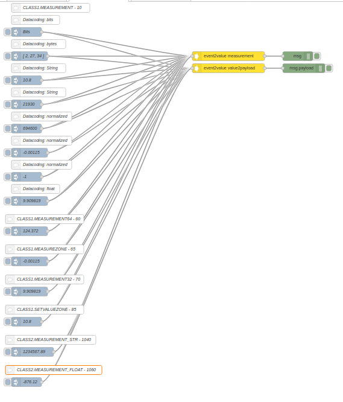
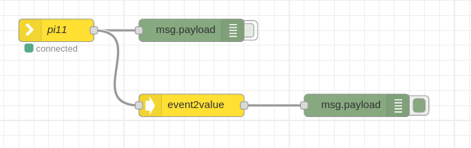

[](http://choosealicense.com/licenses/mit/)
[](https://travis-ci.org/grodansparadis/node-red-contrib-vscp)


# node-red-contrib-vscp
A collection of VSCP (Very Simple Control Protocol) nodes that support building of IoT, m2m and automation related flows.

This assumes you have Node-RED already installed and working, if you need to install Node-RED see [here](https://nodered.org/docs/getting-started/installation)

This software is part of the [VSCP (Very simple control protocol)](https://www.vscp.org) framework.

## Installation

Install via Node-RED Manage Palette

```
node-red-contrib-vscp
```

Install with npm

```
$ cd ~/.node-red
$ npm node-red-contrib-vscp
# Restart node-red
```

Full documentation for VSCP is available at [https://docs.vscp.org](https://docs.vscp.org) and downloads can be found at [https://download.vscp.org](https://download.vscp.org)

---

## can2vscp node


Convert a CAN message to a VSCP event. The CAN message can be on string form or object form.

The node is located in the function section of the palette.

Typically this node is used together with a node such as [node-red-contrib-socketcan](https://www.npmjs.com/package/node-red-contrib-socketcan) or [node-red-contrib-canal](https://www.npmjs.com/package/node-red-contrib-canal) 

---

## vscpfilter node


The flow of VSCP events normally is a flow of events from many different sources and they can for example be measurements from different sensors or information about something that just occurred on a remote node. At some point in a flow you usually need to filter out the event(s) you are interested in so you can react on them or process them further.

You have several options to do this filtering. One way is to filter at the source. A VSCP daemon connection,  VSCP over MQTT connection and CAN4VSCP all allow for filtering at the source. This is also usual the most effective filtering when it comes to resource uses.

The other option and in many cases most convenient is to use this node. It may be easier to open a connection to a VSCP flow and then filter out flows of different types with this node.

You can filter on

* VSCP priority
* VSCP class
* VSCP type
* VSCP GUID

So if you are only interested in events from a specific node enter it's full GUID and leave all other fields blank. This will get you all events from that node. Not entering a value of a filed means **don't care** and this will field will not be checked.

If you are only interested in events from a specific interface on the VSCP daemon we know that the GUID is the same for all events coming from this interface in the first fourteen of the sixteen positions. So enter just the first fourteen values of the GUID in the filter and you will get all events from that interface on the output.

So if event GUID is

```bash
FF:FF:FF:FF:FF:FF:FF:F5:02:00:00:00:10:01:00:44
```

set GUID filter to

```bash
FF:FF:FF:FF:FF:FF:FF:F5:02:00:00:00:10:01
```

and you will get all events that go through that interface.

The most common case is probably to filter out a specific event from a specific remote node. In this case enter the nodes GUID, VSCP class and VSCP type.

Priority filtering is a bit special compared to the other fields. First one must remember that zero is highest priority and seven is the lowest priority in VSCP. Entering a value in teh priority field mean that all events with a priority equal or less than the value will be passed through. Setting the value to zero will only let through events with the highest priority. Setting to seven means all events will be passed through. This last case is the same as leaving the field blank.

## event2value node


For a new VSCP user the measurement classes in VSCP may be both strange at first and even hard to understand. Think of them as different ways for a limited resources device to send data values to a higher level world that have the resources to decode the data. Generally one can say that it is advisable to use Level II measurements in higher level applications like node-red. The VSCP daemon for example have the ability to automatically translate all measurement events from drivers to level II events.

At level II there is two measurement classes available, one that present measurement values on string form [CLASS2.MEASUREMENT_STR](https://docs.vscp.org/spec/latest/#/./class2.measurement_str) and one that present measurement values on floating point form [CLASS2.MEASUREMENT_STR](https://docs.vscp.org/spec/latest/#/./class2.measurement_float).

The event2value node can handle all measurement classes and translate the data they carry to a measurement value and still preserve important information such as unit of the data and the origin of the measurement.

The event2value node will do one of two things.

- It will add fields *value*,  *unit*, *sensorindex* and in cases where it's relevant **index**, **zone** and *subzone* to the msg object under the tag __msg.measurement__ before it is transferred to the output of the node. This is the **default**. The payload will contain the original event.
- It will replace msg.payload with the measurement value. The event is still available as msg.event, and meassage relevant data such as unit is in msg.measurement. The checkbox **Value to payload** should be checked for this to happen.

If the checkbox **Transparent** is checked all events will be feed through the node even if they are not measurement events. This means that the msg.measurement will be added to all measurements events but not to other events and therefore look like any other VSCP event for nodes that are VSCP aware.

Future VSCP nodes may relay on the payload carrying a VSCP event for there processing. It is therefore a better choice to write code that use _msg.measurement.value_ instead of moving the value to msg.payload. At least this is true in all cases except when the node is places last in the stream and a value is left to be processed by displaying it, do calculations etc. But the choice is in the end of course up to the user.

Input can be on VSCP event object form or VSCP string form. Output is always on VSCP event object form.

---


### How to use


Inject a msg.payload in the form af a CAN message. The payload will be converted to a VSCP event on object form as msg.payload output.

A CAN message can be on two different forms. Either it can be an object

```javascript
{
  id: 656897,
  timestamp: 0,
  data: [ 137, 130, 254, 220 ]
}
```

or it can be on string form

```javascript
<can_id>#{R|data}
```

where all values are in hexadecimal.

When VSCP is transferred over CAN ([CAN4VSCP](https://docs.vscp.org/spec/latest/#/./vscp_over_can_can4vscp)) an extended CAN id is always use and remote transmission requests is never used.

Examples of can messages on string form

```javascript
123#DEADBEEF
5AA#  
123##1
213##311  
1F334455#1122334455667788
```

The output payload is a VSCP event object on the form

```javascript
{
    "vscpHead": 80,
    "vscpClass": 10,
    "vscpType": 6,
    "vscpGuid": "00:00:00:00:00:00:00:00:00:00:00:00:00:00:00:2a"
    "vscpData": [11,22,33,44,55],
    "vscpTimeStamp": 34565634,
    "vscpDateTime": "2020-02-24T11:10:59.807Z"
}
```

vscpDateTime is set to current UTC. vscpTomeStamp is resued from CAN message if it has a 'timestamp' member. vscpGuid has the nickname id (LSB of CAN id) set.

### Sample flow

```javascript
[{"id":"3f71cf71.2667c","type":"can2vscp","z":"85e70aa5.e41e7","name":"","x":300,"y":60,"wires":[["d5af1583.cf22"]]},{"id":"db6b2bba.96329","type":"inject","z":"85e70aa5.e41e7","name":"CAN msg [..]","topic":"","payload":"1C0A062A#11223344","payloadType":"str","repeat":"","crontab":"","once":false,"onceDelay":0.1,"x":110,"y":20,"wires":[["3f71cf71.2667c"]]},{"id":"d5af1583.cf22","type":"debug","z":"85e70aa5.e41e7","name":"","active":true,"tosidebar":true,"console":false,"tostatus":false,"complete":"payload","targetType":"msg","x":410,"y":200,"wires":[]},{"id":"a94a0896.8bbfe","type":"inject","z":"85e70aa5.e41e7","name":"JSON [...]","topic":"","payload":"{\"canid\":470418986,\"ext\":true,\"data\":[11,22,33,44],\"dlc\":4}","payloadType":"json","repeat":"","crontab":"","once":false,"onceDelay":0.1,"x":100,"y":120,"wires":[["3f71cf71.2667c"]]},{"id":"e5ef3119.9eb6d","type":"inject","z":"85e70aa5.e41e7","name":"JSON str","topic":"","payload":"{\"canid\":470418986,\"ext\":true,\"data\":\"99,88,77,66\",\"dlc\":4}","payloadType":"json","repeat":"","crontab":"","once":false,"onceDelay":0.1,"x":100,"y":160,"wires":[["3f71cf71.2667c"]]},{"id":"a24011ba.02c308","type":"inject","z":"85e70aa5.e41e7","name":"CAN msg null","topic":"","payload":"1C0A062A#","payloadType":"str","repeat":"","crontab":"","once":false,"onceDelay":0.1,"x":110,"y":60,"wires":[["3f71cf71.2667c"]]},{"id":"a3d3adbe.1ffa78","type":"inject","z":"85e70aa5.e41e7","name":"JSON null","topic":"","payload":"{\"canid\":470418986,\"ext\":true,\"data\":null,\"dlc\":4}","payloadType":"json","repeat":"","crontab":"","once":false,"onceDelay":0.1,"x":100,"y":200,"wires":[["3f71cf71.2667c"]]}]
```

## vscp2can node


Convert a VSCP event to a CAN message. The VSCP event can be on string form or object form.

Typically this node is used together with a node such as [node-red-contrib-socketcan](https://www.npmjs.com/package/node-red-contrib-socketcan) or [node-red-contrib-canal](https://www.npmjs.com/package/node-red-contrib-canal) 

The node is located in the function section of the palette.

### How to use


Inject a message payload into the node on the VSCP object form

'''javascript
{
    vscpHead: 224,
    vscpClass: 10,
    vscpType: 6,
    vscpGuid: "FF:FF:FF:FF:FF:FF:FF:FE:B8:27:EB:40:59:96:00:01",
    vscpData: [15,0,1,35],
    vscpTimeStamp: 32456243,
    vscpDateTime: "2020-02-24T11:10:59.000Z"
}
```

or on the VSCP string form.

'''javascript
vscpHead,vscpClass,vscpType,vscpObId,vscpDateTime,vscpTimeStamp,vscpGuid,vspData
```

Events must be level I events. That is vscpClass must be less than 512, vscpType must be less than 256 and data length max eight bytes.

the output will be a CAN message on this form

```javascript
{
  id: 656897,
  timestamp: 0,
  data: [ 137, 130, 254, 220 ]
}
```

### Sample flow

```javascript
[{"id":"5f847c11.bd3ef4","type":"vscp2can","z":"85e70aa5.e41e7","name":"","x":320,"y":420,"wires":[["abae2436.9249f"]]},{"id":"740073f2.bc2394","type":"inject","z":"85e70aa5.e41e7","name":"JSON array","topic":"","payload":"{\"vscpHead\":80,\"vscpClass\":10,\"vscpType\":6,\"vscpData\":[11,22,33,44,55],\"vscpTimeStamp\":3456}","payloadType":"json","repeat":"","crontab":"","once":false,"onceDelay":0.1,"x":130,"y":420,"wires":[["5f847c11.bd3ef4"]]},{"id":"abae2436.9249f","type":"debug","z":"85e70aa5.e41e7","name":"","active":true,"tosidebar":true,"console":false,"tostatus":false,"complete":"payload","targetType":"msg","x":490,"y":420,"wires":[]},{"id":"6c346126.bfba58","type":"inject","z":"85e70aa5.e41e7","name":"String","topic":"","payload":"0,20,3,,2001-11-02T18:00:01,,-,0,1,35","payloadType":"str","repeat":"","crontab":"","once":false,"onceDelay":0.1,"x":150,"y":500,"wires":[["5f847c11.bd3ef4"]]},{"id":"7df9ce7e.b5cc98","type":"inject","z":"85e70aa5.e41e7","name":"JSON str","topic":"","payload":"{\"vscpHead\":80,\"vscpClass\":10,\"vscpType\":6,\"vscpData\":\"100,200,99\",\"vscpTimeStamp\":3456}","payloadType":"json","repeat":"","crontab":"","once":false,"onceDelay":0.1,"x":140,"y":460,"wires":[["5f847c11.bd3ef4"]]}]
```

### How to use



Any source that issues VSCP events can be used to feed events into the node. The [node-red-contrib-vscp-tcp](https://flows.nodered.org/node/node-red-contrib-vscp-tcp) and [node-red-contrib-canal](https://flows.nodered.org/node/node-red-contrib-canal) are often used but it can equally well be a MQTT node or some other source of events.



The sample flow below inject examples with all measurement classes and output results. There is one standard msg.measurement and one value -> payload translation present for all paths.

### Sample flow

```javascript
[{"id":"7b300eeb.eca0e","type":"tab","label":"Measurements","disabled":false,"info":""},{"id":"84a31eaf.5f1f98","type":"event2value","z":"7b300eeb.eca0e","btransparent":false,"bvalue2payload":false,"name":"event2value measurement","x":760,"y":180,"wires":[["4ff276ee.97a71"]]},{"id":"7e415e1.56527a","type":"inject","z":"7b300eeb.eca0e","name":"694600","topic":"","payload":"{\"vscpHead\":80,\"vscpClass\":10,\"vscpType\":6,\"vscpData\":[136,2,27,34],\"vscpTimeStamp\":3456}","payloadType":"json","repeat":"","crontab":"","once":false,"onceDelay":0.1,"x":90,"y":420,"wires":[["84a31eaf.5f1f98","e741f244.14599"]]},{"id":"4ff276ee.97a71","type":"debug","z":"7b300eeb.eca0e","name":"","active":true,"tosidebar":true,"console":false,"tostatus":false,"complete":"true","targetType":"full","x":990,"y":180,"wires":[]},{"id":"ffd0f467.4a8028","type":"inject","z":"7b300eeb.eca0e","name":"Bits","topic":"","payload":"{\"vscpHead\":80,\"vscpClass\":10,\"vscpType\":6,\"vscpData\":[0,170,170],\"vscpTimeStamp\":3456}","payloadType":"json","repeat":"","crontab":"","once":false,"onceDelay":0.1,"x":90,"y":100,"wires":[["84a31eaf.5f1f98","e741f244.14599"]]},{"id":"45d576da.8c5bc8","type":"inject","z":"7b300eeb.eca0e","name":"[ 2, 27, 34 ]","topic":"","payload":"{\"vscpHead\":80,\"vscpClass\":10,\"vscpType\":6,\"vscpData\":[32,2,27,34],\"vscpTimeStamp\":3456}","payloadType":"json","repeat":"","crontab":"","once":false,"onceDelay":0.1,"x":100,"y":180,"wires":[["84a31eaf.5f1f98","e741f244.14599"]]},{"id":"de16eff7.222bc8","type":"comment","z":"7b300eeb.eca0e","name":"Datacoding: bits","info":"","x":120,"y":60,"wires":[]},{"id":"263e95d3.b51262","type":"comment","z":"7b300eeb.eca0e","name":"Datacoding: normalized","info":"","x":140,"y":380,"wires":[]},{"id":"d23145ae.c5d3c8","type":"comment","z":"7b300eeb.eca0e","name":"Datacoding: bytes","info":"","x":130,"y":140,"wires":[]},{"id":"e741f244.14599","type":"event2value","z":"7b300eeb.eca0e","btransparent":false,"bvalue2payload":true,"name":"event2value value2payload","x":760,"y":220,"wires":[["99e055cc.8a09f"]]},{"id":"99e055cc.8a09f","type":"debug","z":"7b300eeb.eca0e","name":"","active":true,"tosidebar":true,"console":false,"tostatus":false,"complete":"payload","targetType":"msg","x":1010,"y":220,"wires":[]},{"id":"75932ee4.0cc","type":"comment","z":"7b300eeb.eca0e","name":"Datacoding: String","info":"","x":130,"y":220,"wires":[]},{"id":"cae750d6.c92f7","type":"inject","z":"7b300eeb.eca0e","name":"10.8","topic":"","payload":"{\"vscpHead\":80,\"vscpClass\":10,\"vscpType\":6,\"vscpData\":[64,49,48,46,56],\"vscpTimeStamp\":3456}","payloadType":"json","repeat":"","crontab":"","once":false,"onceDelay":0.1,"x":90,"y":260,"wires":[["84a31eaf.5f1f98","e741f244.14599"]]},{"id":"365000b6.de23f8","type":"comment","z":"7b300eeb.eca0e","name":"Datacoding: String","info":"","x":130,"y":300,"wires":[]},{"id":"9ca74a6b.309478","type":"inject","z":"7b300eeb.eca0e","name":"21930","topic":"","payload":"{\"vscpHead\":80,\"vscpClass\":10,\"vscpType\":6,\"vscpData\":[96,85,170],\"vscpTimeStamp\":3456}","payloadType":"json","repeat":"","crontab":"","once":false,"onceDelay":0.1,"x":90,"y":340,"wires":[["84a31eaf.5f1f98","e741f244.14599"]]},{"id":"a758fa62.29154","type":"comment","z":"7b300eeb.eca0e","name":"Datacoding: normalized","info":"","x":140,"y":460,"wires":[]},{"id":"ed7a4873.78a3d8","type":"inject","z":"7b300eeb.eca0e","name":"-0.00115","topic":"","payload":"{\"vscpHead\":80,\"vscpClass\":10,\"vscpType\":6,\"vscpData\":[136,133,141],\"vscpTimeStamp\":3456}","payloadType":"json","repeat":"","crontab":"","once":false,"onceDelay":0.1,"x":100,"y":500,"wires":[["84a31eaf.5f1f98","e741f244.14599"]]},{"id":"f2bc8e83.dd627","type":"comment","z":"7b300eeb.eca0e","name":"Datacoding: normalized","info":"","x":140,"y":540,"wires":[]},{"id":"6efae03e.af699","type":"inject","z":"7b300eeb.eca0e","name":"-1","topic":"","payload":"{\"vscpHead\":80,\"vscpClass\":10,\"vscpType\":6,\"vscpData\":[136,0,255,255,255,255,255,255],\"vscpTimeStamp\":3456}","payloadType":"json","repeat":"","crontab":"","once":false,"onceDelay":0.1,"x":90,"y":580,"wires":[["84a31eaf.5f1f98","e741f244.14599"]]},{"id":"f125be4.f922cc","type":"comment","z":"7b300eeb.eca0e","name":"Datacoding: float","info":"","x":120,"y":620,"wires":[]},{"id":"bc6d3d2.1ba574","type":"inject","z":"7b300eeb.eca0e","name":"9.909819","topic":"","payload":"{\"vscpHead\":80,\"vscpClass\":10,\"vscpType\":6,\"vscpData\":[160,65,30,142,158],\"vscpTimeStamp\":3456}","payloadType":"json","repeat":"","crontab":"","once":false,"onceDelay":0.1,"x":100,"y":660,"wires":[["84a31eaf.5f1f98","e741f244.14599"]]},{"id":"cd4709b3.26c138","type":"comment","z":"7b300eeb.eca0e","name":"CLASS1.MEASUREMENT64 - 60","info":"","x":150,"y":720,"wires":[]},{"id":"3f1c53d2.56f914","type":"inject","z":"7b300eeb.eca0e","name":"124.372","topic":"","payload":"{\"vscpHead\":80,\"vscpClass\":60,\"vscpType\":6,\"vscpData\":[64,95,23,206,217,22,135,43],\"vscpTimeStamp\":3456}","payloadType":"json","repeat":"","crontab":"","once":false,"onceDelay":0.1,"x":100,"y":760,"wires":[["84a31eaf.5f1f98","e741f244.14599"]]},{"id":"49e25db8.62c234","type":"comment","z":"7b300eeb.eca0e","name":"CLASS1.MEASUREMENT -  10","info":"","x":170,"y":20,"wires":[]},{"id":"7e44e793.f847e8","type":"comment","z":"7b300eeb.eca0e","name":"CLASS1.MEASUREZONE - 65","info":"","x":150,"y":820,"wires":[]},{"id":"c605e90e.2954d","type":"inject","z":"7b300eeb.eca0e","name":"-0.00115","topic":"","payload":"{\"vscpHead\":80,\"vscpClass\":65,\"vscpType\":6,\"vscpData\":[0,1,2,136,133,141],\"vscpTimeStamp\":3456}","payloadType":"json","repeat":"","crontab":"","once":false,"onceDelay":0.1,"x":100,"y":860,"wires":[["84a31eaf.5f1f98","e741f244.14599"]]},{"id":"8a60bc5c.66f788","type":"comment","z":"7b300eeb.eca0e","name":"CLASS1.MEASUREMENT32 - 70","info":"","x":150,"y":920,"wires":[]},{"id":"b182aca1.0f67b8","type":"inject","z":"7b300eeb.eca0e","name":"9.909819","topic":"","payload":"{\"vscpHead\":80,\"vscpClass\":10,\"vscpType\":6,\"vscpData\":[160,65,30,142,158],\"vscpTimeStamp\":3456}","payloadType":"json","repeat":"","crontab":"","once":false,"onceDelay":0.1,"x":100,"y":960,"wires":[["84a31eaf.5f1f98","e741f244.14599"]]},{"id":"82a6fb82.4bc948","type":"comment","z":"7b300eeb.eca0e","name":"CLASS1.SETVALUEZONE - 85","info":"","x":150,"y":1020,"wires":[]},{"id":"6c7b0931.9aacf8","type":"inject","z":"7b300eeb.eca0e","name":"10.8","topic":"","payload":"{\"vscpHead\":80,\"vscpClass\":85,\"vscpType\":6,\"vscpData\":[0,1,2,64,49,48,46,56],\"vscpTimeStamp\":3456}","payloadType":"json","repeat":"","crontab":"","once":false,"onceDelay":0.1,"x":90,"y":1060,"wires":[["84a31eaf.5f1f98","e741f244.14599"]]},{"id":"e5de87c1.258218","type":"comment","z":"7b300eeb.eca0e","name":"CLASS2.MEASUREMENT_STR - 1040","info":"","x":170,"y":1120,"wires":[]},{"id":"dc5b3f00.6357a8","type":"inject","z":"7b300eeb.eca0e","name":"1234567.89","topic":"","payload":"{\"vscpHead\":80,\"vscpClass\":1040,\"vscpType\":6,\"vscpData\":[0,1,2,0,49,50,51,52,53,54,55,46,56,57],\"vscpTimeStamp\":3456}","payloadType":"json","repeat":"","crontab":"","once":false,"onceDelay":0.1,"x":110,"y":1160,"wires":[["84a31eaf.5f1f98","e741f244.14599"]]},{"id":"3fadc9e0.37934e","type":"comment","z":"7b300eeb.eca0e","name":"CLASS2.MEASUREMENT_FLOAT - 1060","info":"","x":180,"y":1220,"wires":[]},{"id":"e2fdd13f.4eb138","type":"inject","z":"7b300eeb.eca0e","name":"-876.12","topic":"","payload":"{\"vscpHead\":80,\"vscpClass\":1060,\"vscpType\":6,\"vscpData\":[0,1,2,0,192,139,96,245,194,143,92,41],\"vscpTimeStamp\":3456}","payloadType":"json","repeat":"","crontab":"","once":false,"onceDelay":0.1,"x":90,"y":1260,"wires":[["84a31eaf.5f1f98","e741f244.14599"]]}]
```

---

## Using with node vscp modules

[node-vscp-class](https://www.npmjs.com/package/node-vscp-class) and [node-vscp-type](https://www.npmjs.com/package/node-vscp-type) holds all event definitions for VSCP. If you want to enter event class/type symbolically instead of with magic numbers it is helpful to incorporate the modules into node-red.

First install the modules (go to the .node-red folder)

```bash
npm install node-vscp-class
npm install node-vscp-type
npm install node-vscp
```

Add the module to the settings.js file (also in the .node-red folder).

```javascript
functionGlobalContext: {
    vscpclass:require('node-vscp-class'),
    vscptype:require('node-vscp-type'),
    vscp:require('node-vscp')
}
```

Now restart node-red with

```bash
systemctl restart nodered
```

in a **function node** you can now refer to VSCP events symbolically, like

```javascript
 var ev = new (global.get('vscp')).Event({
    vscpHead: global.get('vscp').priority.PRIORITY_6 << 5,
    vscpClass: global.get('vscp_class').VSCP_CLASS1_MEASUREMENT,
    vscpType: global.get('vscp_type').VSCP_TYPE_MEASUREMENT_TEMPERATURE,
    vscpGuid: "FF:FF:FF:FF:FF:FF:FF:FE:B8:27:EB:40:59:96:00:01",
    vscpsizeData: 4,
    vscpData: [0x89,0x82,0xFE,0xDC]
});
msg.payload = ev;
return msg;
```


---

## VSCP & friends
The VSCP subsystem consist of many system components. 

### VSCP Daemon
The VSCP daemon is a central piece of software that act as a hub for VSCP based hardware or hardware that abstract as VSCP hardware, You can find the documentation for the VSCP daemon [here](https://docs.vscp.org/#vscpd).

### VSCP Works
VSCP works is a tool that make sinteraction with VSCP system components easy. VSCP Works is documented [here](https://docs.vscp.org/#vscpworks).

### VSCP Helper library
The VSCP helper library is a c/c++ library with common VSCP functionality. It is available for Python to and will be available for PHP and node.js. It is documented [here](https://docs.vscp.org/#vscphelper);  

### More
There is plenty of other tools available in the VSCP subsystem. Check the docs and the downloads.

### Other VSCP node-red nodes

There are other node-red parts in development or already available that makes it possible to easily connect to websocket interfaces on remote VSCP daemons/servers or hosts.

Checkout [node-red-contrib-vscp-tcp](https://www.npmjs.com/package/node-red-contrib-vscp-tcp) that contains nopes that connect to a remote VSCP tcp/ip host interface and send/receive events.

If you work with CAN, and especially CAN4VSCP, you might find [node-red-contrib-socketcan](https://www.npmjs.com/package/node-red-contrib-socketcan) and  [node-red-contrib-canal](https://www.npmjs.com/package/node-red-contrib-canal) useful.

---
Copyright © 2000-2020 Åke Hedman, Grodans Paradis AB