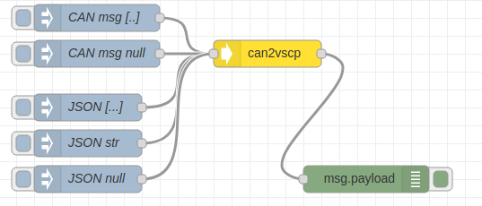
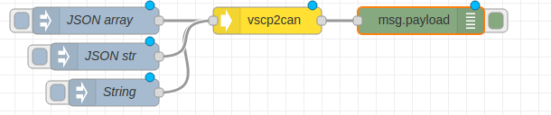

[](http://choosealicense.com/licenses/mit/)
[](https://travis-ci.org/grodansparadis/node-red-contrib-vscp)


# node-red-contrib-vscp
A collection of VSCP (Very Simple Control Protocol) nodes that support building of IoT, m2m and automation related flows. 

This assumes you have Node-RED already installed and working, if you need to install Node-RED see [here](https://nodered.org/docs/getting-started/installation)

This software is part of the [VSCP (Very simple control protocol)](https://www.vscp.org) framework.

## Installation

Install via Node-RED Manage Palette

```
node-red-contrib-vscp
```

Install with npm

```
$ cd ~/.node-red
$ npm node-red-contrib-vscp
# Restart node-red
```

Full documentation for VSCP is available at [https://docs.vscp.org](https://docs.vscp.org) and downloads can be found at [https://download.vscp.org](https://download.vscp.org)

---

## can2vscp node


Convert a CAN message to a VSCP event. The CAN message can be on string form or object form.

The node is located in the function section of the palette.

Typically this node is used together with a node such as [node-red-contrib-socketcan](https://www.npmjs.com/package/node-red-contrib-socketcan) or [node-red-contrib-canal](https://www.npmjs.com/package/node-red-contrib-canal) 

### How to use



Inject a msg.payload in the form af a CAN message. The payload will be converted to a VSCP event on object form as msg.payload output.

A CAN message can be on two different forms. Either it can be an object

```javascript
{
  ext: true,
  rtr: false,
  canid: 656897,
  timestamp: 0,
  dlc: 4,
  data: [ 137, 130, 254, 220 ]
}
```

or it can be on string form

```javascript
<can_id>#{R|data}
```

where all values are in hexadecimal.

When VSCP is transferred over CAN ([CAN4VSCP](https://docs.vscp.org/spec/latest/#/./vscp_over_can_can4vscp)) an extended CAN id is always use and remote transmission requests is never used.

Examples of can messages on string form

```javascript
123#DEADBEEF 
5AA#  
123##1
213##311  
1F334455#1122334455667788
```

The output payload is a VSCP event object on the form

```javascript
{
    "vscpHead": 80,
    "vscpClass": 10,
    "vscpType": 6,
    "vscpGuid": "00:00:00:00:00:00:00:00:00:00:00:00:00:00:00:2a"
    "vscpData": [11,22,33,44,55],
    "vscpTimeStamp": 34565634,
    vscpDateTime: 2020-02-24T11:10:59.807Z
}
```

vscpDateTime is set to current UTC. vscpTomeStamp is resued from CAN message if it has a 'timestamp' member. vscpGuid has the nickname id (LSB of CAN id) set.

### Sample flow

```javascript
[{"id":"3f71cf71.2667c","type":"can2vscp","z":"85e70aa5.e41e7","name":"","x":300,"y":60,"wires":[["d5af1583.cf22"]]},{"id":"db6b2bba.96329","type":"inject","z":"85e70aa5.e41e7","name":"CAN msg [..]","topic":"","payload":"1C0A062A#11223344","payloadType":"str","repeat":"","crontab":"","once":false,"onceDelay":0.1,"x":110,"y":20,"wires":[["3f71cf71.2667c"]]},{"id":"d5af1583.cf22","type":"debug","z":"85e70aa5.e41e7","name":"","active":true,"tosidebar":true,"console":false,"tostatus":false,"complete":"payload","targetType":"msg","x":410,"y":200,"wires":[]},{"id":"a94a0896.8bbfe","type":"inject","z":"85e70aa5.e41e7","name":"JSON [...]","topic":"","payload":"{\"canid\":470418986,\"ext\":true,\"data\":[11,22,33,44],\"dlc\":4}","payloadType":"json","repeat":"","crontab":"","once":false,"onceDelay":0.1,"x":100,"y":120,"wires":[["3f71cf71.2667c"]]},{"id":"e5ef3119.9eb6d","type":"inject","z":"85e70aa5.e41e7","name":"JSON str","topic":"","payload":"{\"canid\":470418986,\"ext\":true,\"data\":\"99,88,77,66\",\"dlc\":4}","payloadType":"json","repeat":"","crontab":"","once":false,"onceDelay":0.1,"x":100,"y":160,"wires":[["3f71cf71.2667c"]]},{"id":"a24011ba.02c308","type":"inject","z":"85e70aa5.e41e7","name":"CAN msg null","topic":"","payload":"1C0A062A#","payloadType":"str","repeat":"","crontab":"","once":false,"onceDelay":0.1,"x":110,"y":60,"wires":[["3f71cf71.2667c"]]},{"id":"a3d3adbe.1ffa78","type":"inject","z":"85e70aa5.e41e7","name":"JSON null","topic":"","payload":"{\"canid\":470418986,\"ext\":true,\"data\":null,\"dlc\":4}","payloadType":"json","repeat":"","crontab":"","once":false,"onceDelay":0.1,"x":100,"y":200,"wires":[["3f71cf71.2667c"]]}]
```

## vscp2can node


Convert a VSCP event to a CAN message. The VSCP event can be on string form or object form.

Typically this node is used together with a node such as [node-red-contrib-socketcan](https://www.npmjs.com/package/node-red-contrib-socketcan) or [node-red-contrib-canal](https://www.npmjs.com/package/node-red-contrib-canal) 

The node is located in the function section of the palette.

### How to use



Inject a message payload into the node on the VSCP object form

'''javascript
{
    vscpHead: 224,
    vscpClass: 10,
    vscpType: 6,
    vscpGuid: "FF:FF:FF:FF:FF:FF:FF:FE:B8:27:EB:40:59:96:00:01",
    vscpData: [15,0,1,35],
    vscpTimeStamp: 32456243,
    vscpDateTime: "2020-02-24T11:10:59.000Z"
}
```

or on the VSCP string form.

'''javascript
vscpHead,vscpClass,vscpType,vscpObId,vscpDateTime,vscpTimeStamp,vscpGuid,vspData
```

Events must be level I events. That is vscpClass must be less than 512, vscpType must be less than 256 and data length max eight bytes.

the output will be a CAN message on this form

```javascript
{
  ext: true,
  rtr: false,
  canid: 656897,
  timestamp: 0,
  dlc: 4,
  data: [ 137, 130, 254, 220 ]
}
```

### Sample flow

```javascript
[{"id":"5f847c11.bd3ef4","type":"vscp2can","z":"85e70aa5.e41e7","name":"","x":320,"y":420,"wires":[["abae2436.9249f"]]},{"id":"740073f2.bc2394","type":"inject","z":"85e70aa5.e41e7","name":"JSON array","topic":"","payload":"{\"vscpHead\":80,\"vscpClass\":10,\"vscpType\":6,\"vscpData\":[11,22,33,44,55],\"vscpTimeStamp\":3456}","payloadType":"json","repeat":"","crontab":"","once":false,"onceDelay":0.1,"x":130,"y":420,"wires":[["5f847c11.bd3ef4"]]},{"id":"abae2436.9249f","type":"debug","z":"85e70aa5.e41e7","name":"","active":true,"tosidebar":true,"console":false,"tostatus":false,"complete":"payload","targetType":"msg","x":490,"y":420,"wires":[]},{"id":"6c346126.bfba58","type":"inject","z":"85e70aa5.e41e7","name":"String","topic":"","payload":"0,20,3,,2001-11-02T18:00:01,,-,0,1,35","payloadType":"str","repeat":"","crontab":"","once":false,"onceDelay":0.1,"x":150,"y":500,"wires":[["5f847c11.bd3ef4"]]},{"id":"7df9ce7e.b5cc98","type":"inject","z":"85e70aa5.e41e7","name":"JSON str","topic":"","payload":"{\"vscpHead\":80,\"vscpClass\":10,\"vscpType\":6,\"vscpData\":\"100,200,99\",\"vscpTimeStamp\":3456}","payloadType":"json","repeat":"","crontab":"","once":false,"onceDelay":0.1,"x":140,"y":460,"wires":[["5f847c11.bd3ef4"]]}]
```

---

## Using with node vscp modules

[node-vscp-class](https://www.npmjs.com/package/node-vscp-class) and [node-vscp-type](https://www.npmjs.com/package/node-vscp-type) holds all event definitions for VSCP. If you want to enter event class/type symbolically instead of with magic numbers it is helpful to incorporate the modules into node-red.

First install the modules (go to the .node-red folder)

```bash
npm install node-vscp-class
npm install node-vscp-type
npm install node-vscp
```

Add the module to the settings.js file (also in the .node-red folder).

```javascript
functionGlobalContext: {
    vscpclass:require('node-vscp-class'),
    vscptype:require('node-vscp-type'),
    vscp:require('node-vscp')
}
```

Now restart node-red with

```bash
systemctl restart nodered
```

in a **function node** you can now refere to VSCP events symbolically, like

```javascript
 var ev = new (global.get('vscp')).Event({
    vscpHead: global.get('vscp').priority.PRIORITY_6 << 5,
    vscpClass: global.get('vscp_class').VSCP_CLASS1_MEASUREMENT,
    vscpType: global.get('vscp_type').VSCP_TYPE_MEASUREMENT_TEMPERATURE,
    vscpGuid: "FF:FF:FF:FF:FF:FF:FF:FE:B8:27:EB:40:59:96:00:01",
    vscpsizeData: 4,
    vscpData: [0x89,0x82,0xFE,0xDC]
});
msg.payload = ev;
return msg; 
```


---

## VSCP & friends
The VSCP subsystem consist of many system components. 

### VSCP Daemon
The VSCP daemon is a central piece of software that act as a hub for VSCP based hardware or hardware that abstract as VSCP hardware, You can find the documentation for the VSCP daemon [here](https://docs.vscp.org/#vscpd).

### VSCP Works
VSCP works is a tool that make sinteraction with VSCP system components easy. VSCP Works is documented [here](https://docs.vscp.org/#vscpworks).

### VSCP Helper library
The VSCP helper library is a c/c++ library with common VSCP functionality. It is available for Python to and will be available for PHP and node.js. It is documented [here](https://docs.vscp.org/#vscphelper);  

### More
There is plenty of other tools available in the VSCP subsystem. Check the docs and the downloads.

### Other VSCP node-red nodes

There are other node-red parts in development or already available that makes it possible to easily connect to websocket interfaces on remote VSCP daemons/servers or hosts.

Checkout [node-red-contrib-vscp-tcp](https://www.npmjs.com/package/node-red-contrib-vscp-tcp) that contains nopes that connect to a remote VSCP tcp/ip host interface and send/receive events.

If you work with CAN, and especially CAN4VSCP, you might find [node-red-contrib-socketcan](https://www.npmjs.com/package/node-red-contrib-socketcan) and  [node-red-contrib-canal](https://www.npmjs.com/package/node-red-contrib-canal) useful.

---
Copyright © 2000-2020 Åke Hedman, Grodans Paradis AB